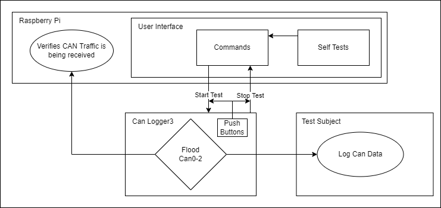

# CANBusTester
CAN Bus testing device used to run CAN loggers at full bus load.

## Requirements
- Operates at 100% bus load
- Universal compatibility with test subjects
- Fast and simple to use
- Implements self tests to isolate the testing system and verify it works

## Test Box Structure

## Hardware implementation
- Hardware description
