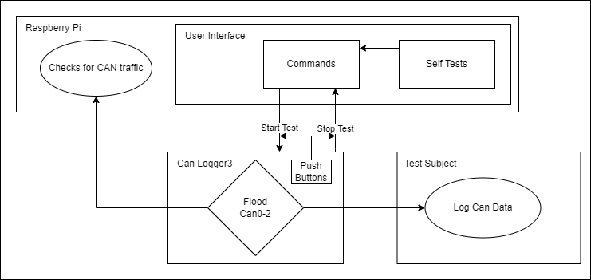
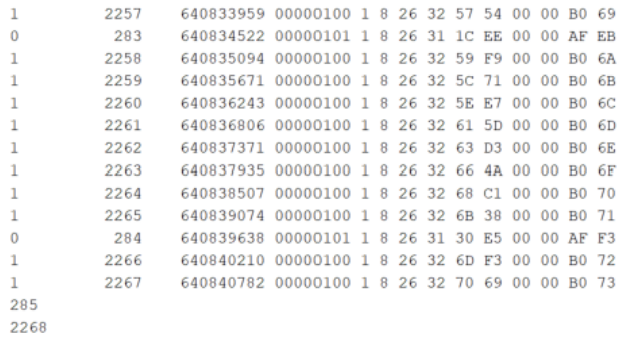
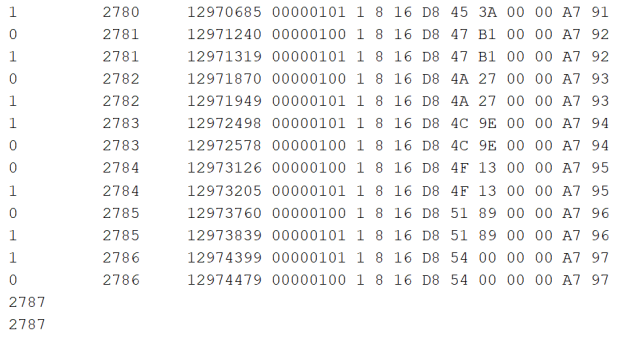
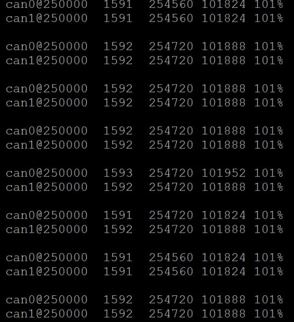

# CANBusTester
System used to stress test CAN logging devices at full bus load.

## Requirements
- Operates at 100% bus load
- Test Subject outputs a log file to determine if the test was successful
- Doesn't rely on an operating system
- Implements self tests to isolate the testing system and verify it works

## Test System Block Diagram

## Implementation
* **Raspberry pi**
  - User Interface
    * Allows for flooding the bus with start and stop commands to the CAN Logger 3
    * Configuring and running self tests
  - CAN Shield
    * Checks to see if voltage and resistance on the CAN bus are correct
* **CAN Logger 3**
  - Flood CAN0-2
    * Floods the bus at 100% bus load to obersve if any packets get dropped
    * Push buttons can be used to start and stop test in addition to UI
* **Test Subject**
  - Logs can data
    * Outputs CAN data into a log file that determines wether the test was passed

## Test Case
* **CAN Logger 3**
  - To find out wether a single CAN Logger 3 could handle sending and receiving messages on two separate CAN lines at 100% bus load the device was set to send messages with a 630us interval. The figure below is a comparison between using only one CAN logger(left) and two CAN Loggers(right). It can be seen that the single CAN Logger dropped a significant amount of frames.

    
  
  - Truck Cape was used to verify network usage was at 100%

  
  

